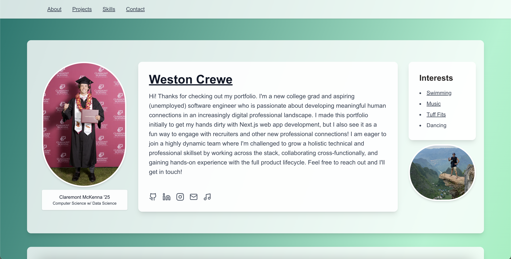

# Weston Crewe — Developer Portfolio

A personal, modular portfolio website built with **Next.js** and **Tailwind CSS**, designed to showcase my work, projects, and personality in a clean, responsive layout.

This site is my central hub — part résumé, part portfolio, part playground — and serves as a live example of my frontend development skills. I plan to continue working on this portfolio, as it is only MVP status right now. My next additions/improvements will include:
- Additional projects
- More dynamic and interactive UI design

---

## Features

- **Modular component architecture** — Easily add, remove, or reorder portfolio sections without breaking the layout
- **Responsive design** — Built with Tailwind CSS utility classes
- **Optimized images** — Uses `next/image` for fast loading and responsive sizing
- **Call-to-action sections** — Invite collaboration, showcase active projects, and provide quick links to my résumé and LinkedIn
- **Project highlights** — Links to active GitHub repositories for ongoing work

---

## Tech Stack

**Frontend**
- [Next.js](https://nextjs.org/) — React framework for fast, server-rendered and statically-generated sites.
- [Tailwind CSS](https://tailwindcss.com/) — Utility-first CSS for rapid UI building.

**Deployment**
- [Vercel](https://vercel.com/) — Seamless hosting and CI/CD for Next.js.

---

## Sections

- **Hero Section** — A welcoming intro with a headline, personal photo, and quick navigation.
- **Call To Action (CTA)** — Center-aligned imagery, tagline, résumé download button, and collaboration invites.
- **Project Showcase** — Highlights select GitHub repos with links and descriptions.
- **Contact Links** — Direct access to email, LinkedIn, and other professional platforms.

---

## Viewing the Project

This repository serves as **documentation** for my personal portfolio site and as an opportunity for others to view the code, structure, and design decisions behind it.  

If you’d like to see the live version, visit the link below:  

**🔗 [View Live Site](https://westoncrewe-portfolio.vercel.app/)**

You’re welcome to browse the source files here on GitHub to explore:
- How sections are structured for modularity
- How Tailwind CSS is applied for rapid styling
- How Next.js is used for routing, image optimization, and layout

Please note: This is a personal project, not an open-source template.

---

## Preview

